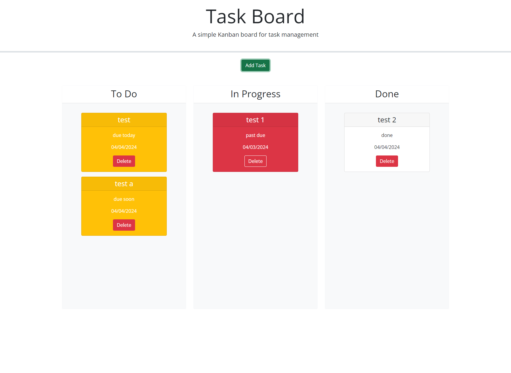

# Task Board

## Description

The goal of this project is to allows a team to manage project tasks by modifying starter code.

- My motivation is to learn more about HTML,css and JQuery.
- I built this project to improve my code writing skill. 
- By applying proper semantics to the HTML file, it is more organized and easily to identify problems. 
- I learned ways to structure HTML, css and APIs.

## Usage

https://pandord24.github.io/Task-Board/

By clicking the link provided, you can access the project hosted by github.

## Credits

Gordon Kwan
https://github.com/pandord24
